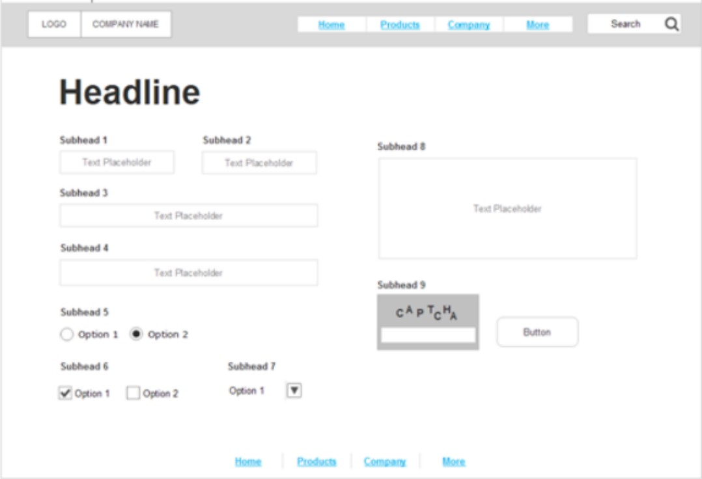
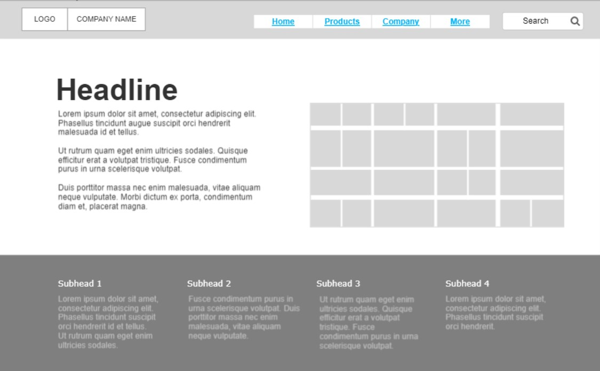
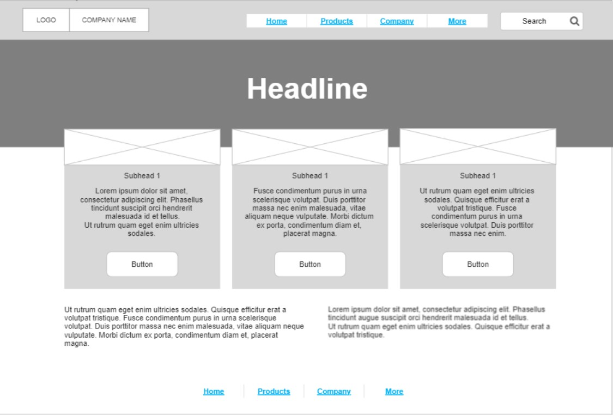

# wireframe2website

## Convert the following **Wireframe** to **Html** pages 

* ### **TOOLS ⚙️**
   * **Html  **
   * **Visual Studio Code **
   

* ### **Home page** 
* ### **Products page** 
* ### **Company page** 
* ### **More page** 

***AWBGCE*** 🌼❤️ AMANI ZYOUD 